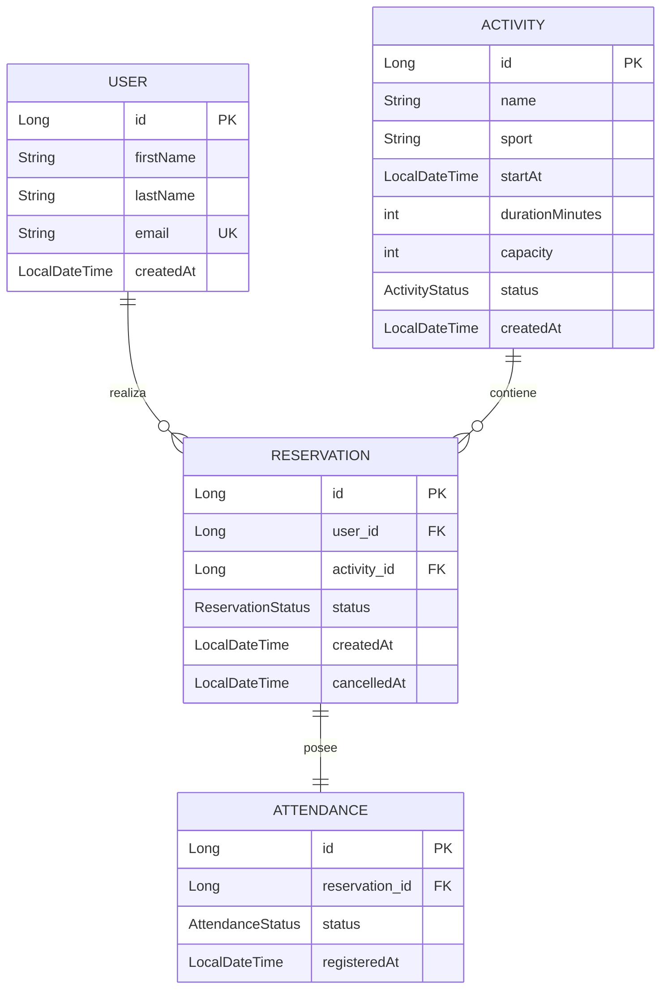
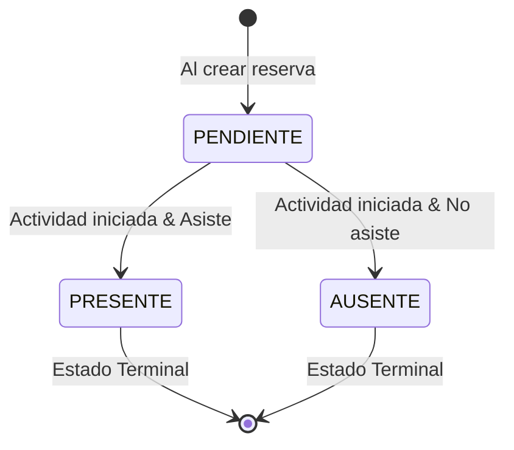
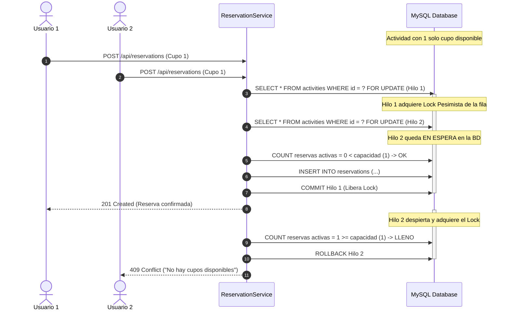

# 🏆 Sports Reservations API — Portfolio Backend

[](https://openjdk.org/)
[](https://spring.io/projects/spring-boot)
[](https://www.mysql.com/)
[](https://www.docker.com/)
[](http://localhost:8080/swagger-ui.html)
[]()
[](LICENSE)

Backend RESTful de nivel de producción desarrollado en **Java 21** y **Spring Boot 4** para la administración integral de un complejo deportivo: gestión de usuarios, programación de actividades con cupos dinámicos, reservas transaccionales concurrentes con prevención de sobreventa (*overbooking*), y control de asistencia mediante máquina de estados finita (FSM).

---

## 📌 Aspectos Destacados de Ingeniería

* **Control Estricto de Concurrencia (ACID):** Uso de **Bloqueo Pesimista de Escritura** (`SELECT ... FOR UPDATE`) a nivel de base de datos para prevenir condiciones de carrera cuando múltiples usuarios compiten por los últimos cupos disponibles.
* **Máquina de Estados Finita (FSM):** Flujo unidireccional estricto de asistencia (`PENDIENTE` $\rightarrow$ `PRESENTE` / `AUSENTE`) con validaciones de precondición temporal y estados terminales irreversibles.
* **Consultas Dinámicas con JPA Criteria API:** Filtrado flexible y combinable de actividades por deporte, estado y rangos temporales mediante `Specification<Activity>`.
* **Cancelación Lógica (Soft Delete):** Preservación de trazabilidad histórica y consistencia referencial para reportería y auditoría.
* **Manejo Centralizado de Excepciones:** Respuestas HTTP uniformes bajo estándar RFC 7807 (`@RestControllerAdvice`).
* **Suite de Pruebas Exhaustiva:** **89 tests automatizados** que abarcan pruebas unitarias con Mockito/AssertJ, pruebas de capa web con `MockMvc`, persistencia `@DataJpaTest`, y un test de integración multihilo que simula disputas de cupos con `CountDownLatch` y `ExecutorService`.
* **DevOps & Contenerización:** `Dockerfile` multi-stage ligero con Eclipse Temurin JRE y usuario no-root, orquestado con `docker-compose.yml` y pipeline de Integración Continua en **GitHub Actions**.

---

## 🏛 Arquitectura y Modelo de Dominio

### Diagrama Entidad-Relación (ERD)



### Máquina de Estados de Asistencia (FSM)



### Prevención de Condiciones de Carrera (Pessimistic Locking)



---

## 📋 Catálogo de Endpoints REST (18 Endpoints)

La API cuenta con 18 endpoints organizados bajo el prefijo `/api`:

### 👤 Usuarios (`/api/users`)
| Método | Endpoint | Descripción | Códigos HTTP |
| :--- | :--- | :--- | :--- |
| `POST` | `/api/users` | Registrar un nuevo usuario | `201`, `400`, `409` |
| `GET` | `/api/users/{id}` | Obtener usuario por ID | `200`, `404` |
| `GET` | `/api/users` | Listar todos los usuarios | `200` |
| `PUT` | `/api/users/{id}` | Actualizar datos de usuario | `200`, `400`, `404`, `409` |
| `DELETE` | `/api/users/{id}` | Eliminar usuario (si no tiene reservas) | `204`, `404`, `409` |

### 🏋️ Actividades (`/api/activities`)
| Método | Endpoint | Descripción | Códigos HTTP |
| :--- | :--- | :--- | :--- |
| `POST` | `/api/activities` | Programar una nueva actividad deportiva | `201`, `400`, `409` |
| `GET` | `/api/activities/{id}` | Consultar actividad con cálculo de cupos | `200`, `404` |
| `GET` | `/api/activities` | Listar actividades con filtros dinámicos (`sport`, `status`, `from`, `to`) | `200` |
| `PUT` | `/api/activities/{id}` | Modificar datos editables de una actividad futura | `200`, `400`, `404`, `409` |
| `DELETE` | `/api/activities/{id}` | Cancelación lógica de una actividad | `204`, `404`, `409` |

### 🎟️ Reservas (`/api/reservations`)
| Método | Endpoint | Descripción | Códigos HTTP |
| :--- | :--- | :--- | :--- |
| `POST` | `/api/reservations` | Crear reserva con bloqueo pesimista contra sobreventa | `201`, `400`, `404`, `409` |
| `GET` | `/api/reservations/{id}` | Obtener detalle de una reserva | `200`, `404` |
| `DELETE` | `/api/reservations/{id}` | Cancelar una reserva (libera el cupo de inmediato) | `204`, `404`, `409` |
| `GET` | `/api/users/{userId}/reservations` | Consultar reservas de un usuario | `200`, `404` |
| `GET` | `/api/activities/{activityId}/reservations` | Consultar reservas de una actividad | `200`, `404` |

### ⏱️ Asistencia (`/api/reservations/{id}/attendance`)
| Método | Endpoint | Descripción | Códigos HTTP |
| :--- | :--- | :--- | :--- |
| `PUT` | `/api/reservations/{id}/attendance` | Registrar `PRESENTE` o `AUSENTE` (FSM irreversible) | `200`, `400`, `404`, `409` |
| `GET` | `/api/activities/{activityId}/attendance` | Consultar asistencias por actividad | `200`, `404` |
| `GET` | `/api/users/{userId}/attendance` | Consultar historial de asistencias de un usuario | `200`, `404` |

---

## 🛠️ Stack Tecnológico

* **Lenguaje:** Java 21 (LTS)
* **Framework:** Spring Boot 4.1.1
* **Persistencia:** Spring Data JPA / Hibernate ORM
* **Base de Datos:** MySQL 8.0 (Producción/Docker) / H2 In-Memory (Tests)
* **Validación:** Jakarta Bean Validation (`hibernate-validator`)
* **Documentación:** Springdoc OpenAPI 3 / Swagger UI 2.8.5
* **Observabilidad:** Spring Boot Actuator
* **Testing:** JUnit 5, Mockito, AssertJ, Spring WebMvcTest, Spring DataJpaTest, SpringBootTest
* **DevOps:** Docker, Docker Compose, GitHub Actions CI

---

## 📖 Architecture Decision Records (ADRs)

Las decisiones arquitectónicas clave se encuentran documentadas en la carpeta [`docs/adr/`](docs/adr/):
* [**ADR-0001:** Bloqueo Pesimista (SELECT FOR UPDATE) para Control de Cupos y Prevención de Overbooking](docs/adr/0001-bloqueo-pesimista-concurrencia.md)
* [**ADR-0002:** Máquina de Estados Finita Unidireccional para Control de Asistencia](docs/adr/0002-maquina-estados-asistencia.md)
* [**ADR-0003:** Cancelación Lógica (Soft Delete) vs Eliminación Física para Actividades y Reservas](docs/adr/0003-cancelacion-logica-vs-fisica.md)

---

## 🚀 Puesta en Marcha

### Opción 1: Ejecución con Docker Compose (Recomendada)

Solo requieres tener instalado Docker / Podman:

```bash
docker compose up --build -d
```

* **API Base URL:** `http://localhost:8080/api`
* **Swagger UI interactivo:** `http://localhost:8080/swagger-ui.html`
* **OpenAPI JSON Spec:** `http://localhost:8080/v3/api-docs`
* **Health Check (Actuator):** `http://localhost:8080/actuator/health`

Para detener el entorno:
```bash
docker compose down
```

---

### Opción 2: Ejecución Local con Maven

1. Asegúrate de tener **JDK 21** configurado.
2. Inicia un contenedor MySQL o tu instancia local:
   ```bash
   docker run --name mysql-local -e MYSQL_ROOT_PASSWORD=root -e MYSQL_DATABASE=reservas_db -p 3306:3306 -d mysql:8.0
   ```
3. Ejecuta la aplicación con el wrapper de Maven:
   ```bash
   ./mvnw spring-boot:run
   ```

---

## 🧪 Ejecución de Tests

Para compilar y correr los **89 tests automatizados**:

```bash
./mvnw clean test
```

### Cobertura de Pruebas:
* **Pruebas de Repositorio (`@DataJpaTest`):** Verificación de restricciones de unicidad compuestas y consultas derivadas.
* **Pruebas de Servicio (`Mockito` + `AssertJ`):** Cobertura exhaustiva de reglas de negocio, errores de dominio, transiciones de estado e invariantes.
* **Pruebas de Controlador (`@WebMvcTest`):** Verificación de contratos HTTP, cabeceras `Location`, validación de payloads y códigos de respuesta.
* **Prueba de Concurrencia Multihilo (`@SpringBootTest`):** Test real de carreras críticas con `CountDownLatch` y `ExecutorService` que certifica la imposibilidad de sobreventa de cupos.

---

## 👨‍💻 Autor

**Simón Castillo**  
* Ingeniero de Software / Backend Developer
* [GitHub](https://github.com/simon-castillo-01b)
